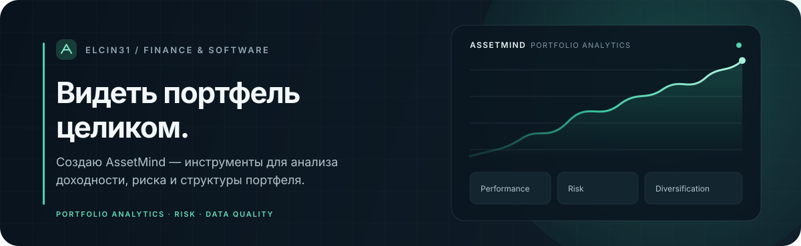
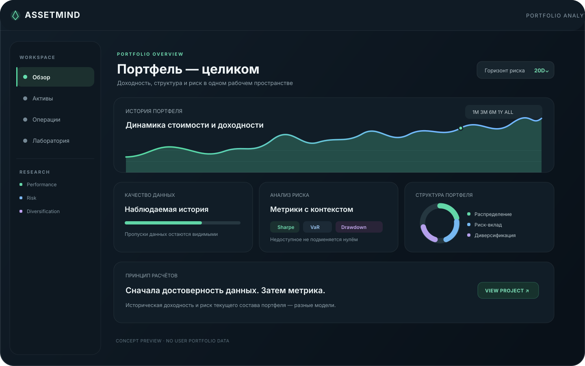

  

  

    
    
  

## Привет, я elcin31

Создаю **AssetMind** — инструменты, которые помогают разобраться в инвестиционном портфеле: из чего складывается результат, где сосредоточен риск и насколько надёжны исходные данные.

  
  Визуальное превью интерфейса — без пользовательских данных и выдуманных показателей.

## AssetMind

| Направление | Что можно изучить |
| --- | --- |
| **История и доходность** | Позиции и операции во времени, доходность портфеля и качество исторических данных |
| **Риск** | Волатильность, просадки, Sharpe, Sortino, VaR и Expected Shortfall |
| **Диверсификация** | Корреляции, ковариации и вклад позиций в общий риск |
| **Сценарии и сравнение** | Бенчмарки, атрибуция результата и гипотетические стресс-сценарии |

### Принципы

- Расчёты отделены от интерфейса и проверяются как самостоятельная математическая логика.
- Если истории недостаточно, показатель остаётся недоступным — данные не подменяются нулями.
- Историческая доходность портфеля и риск текущего состава портфеля показываются как разные вещи.
- Сценарии помогают исследовать чувствительность портфеля, но не предсказывают рынок и не дают инвестиционных рекомендаций.

### Технологии

  
  
  
  
  

---

  <a href="https://github.com/elcin31/assetmind-v031">AssetMind на GitHub</a>
  &nbsp;·&nbsp;
  <a href="https://assetmind-v031-mpsk.vercel.app">Открыть приложение</a>

